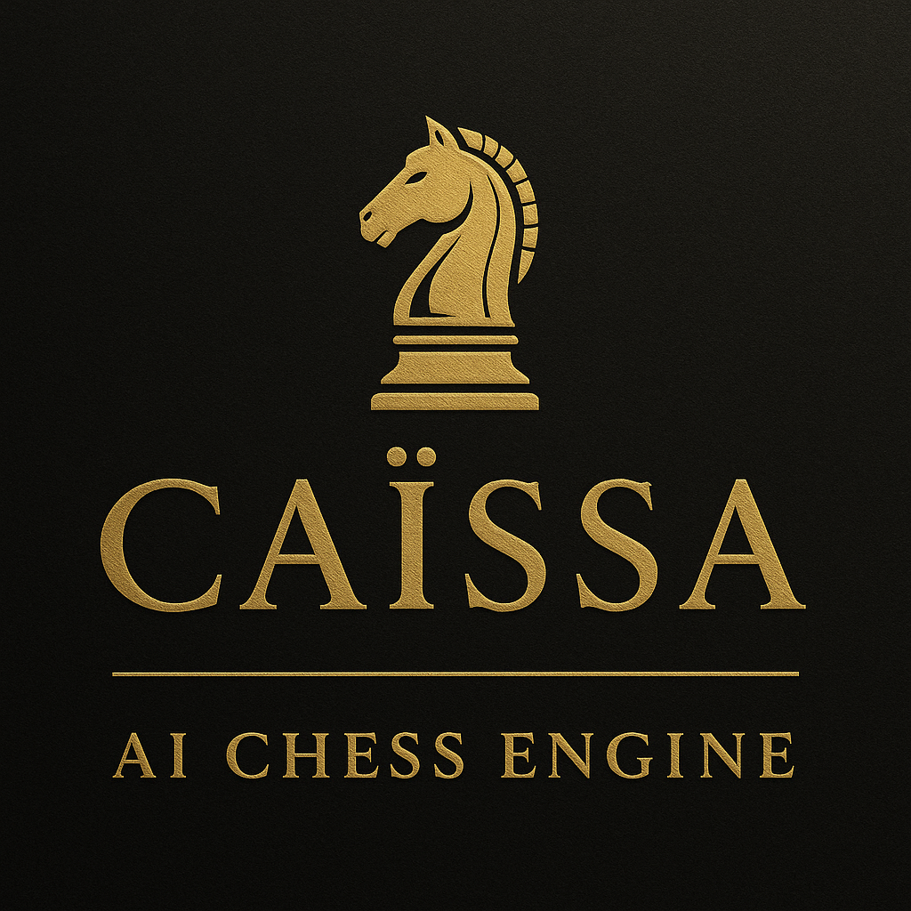
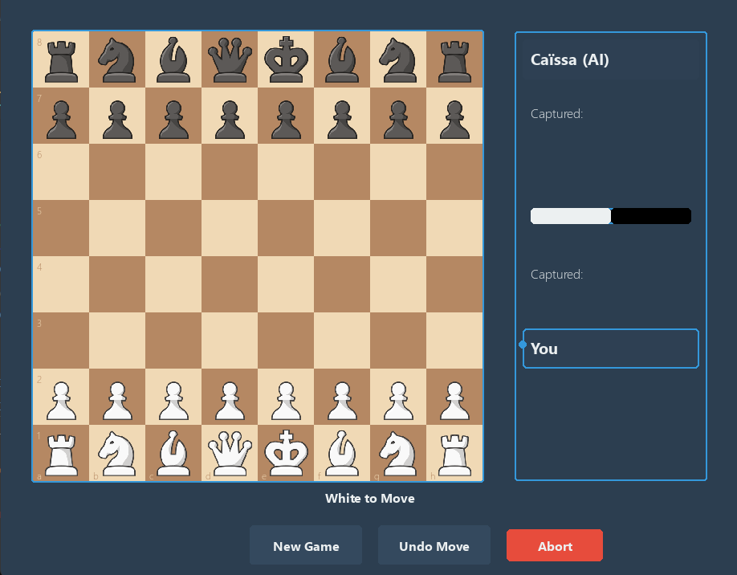

<p align="center">
  
</p>

<h1 align="center">♟️ Caïssa – AI Chess Engine</h1>

<p align="center">
A Python-based chess engine powered by Minimax + Alpha–Beta pruning, built with Pygame.
</p>

---

## 🚀 Features
- ✔️ **Three Game Modes**
  - Player vs Player (PvP)  
  - Player vs AI (PvAI)  
  - AI vs AI (AiAi)

- ✔️ **Full Chess Rule Support**
  - Legal move generation  
  - Castling  
  - En passant  
  - Pawn promotion  
  - Check / Checkmate detection  
  - Move validation  

- ✔️ **AI Engine**
  - Minimax with Alpha-Beta pruning  
  - Depth configurable  
  - Basic positional evaluation  
  - Quiescence search (optional)

- ✔️ **Graphics**
  - Board and piece rendering using **Pygame**  
  - Smooth move animations (if enabled)

- ✔️ **Code Structure**
  - Modular design  
  - Clear separation between:
    - Engine  
    - Board representation  
    - AI  
    - GUI  
    - Game loop  
  - Beginner-friendly with comments  

---

## 📁 Project Structure
```
Caissa-AI-Chess-BOT/
│
├── Caissa_Chess_Engine_Presentation
│
├── assets/
│ ├── pieces/ # Chess piece sprites
│ ├── banner.png # Project banner
│ └── logo.png # Project logo
│
├── engine/
│ ├── chessEngine.py # Board logic, move generation, check/checkmate
│ ├── SmartMoveFinder.py # AI engine: NegaMax + Alpha-Beta pruning
│ └── init.py
│
├── gui/
│ ├── chessMain.py # Pygame main loop (entry point)
│ └── init.py
│
├── archive/
│ └── backup.py # Archived/old code (not part of core)
│
├── LICENSE
├── requirements.txt
├── README.md
└── .gitignore

```

---

## 🛠️ Installation

### 1️⃣ Clone the Repository
```bash
git clone https://github.com/Utkarsh0uchiha/Caissa-AI-Chess-BOT
cd Caissa-AI-Chess-BOT
```
### 2️⃣ Install Dependencies
```
pip install -r requirements.txt

```
### ▶️ Running the Game
```
python gui/chessMain.py
```
---
## ⚙️ Configuration

### You can tweak the engine in the configuration section of the code:
  - AI depth
  - Animation toggle
  - Theme
  - AI vs AI speed
  - Evaluation tuning
---
## 🖼️ Screenshot

### Interface:
<p align="center">  </p> <p align="center"> </p>

---

## 🧩 Future Improvements
  - Stronger evaluation function
  - Opening book
  - Transposition table
  - Endgame tablebases
  - Zobrist hashing
  - PGN/FEN import & export
  - Online multiplayer support

---
## 🤝 Contributing
  - Pull requests are welcome! Just make sure your code is clean and modular.
---

## 📜 License
 - This project is licensed under the MIT License. You are free to use, modify, and distribute.

---

## ⭐ Support the Project
  - If you like Caïssa, please star ⭐ the repo — it motivates development!
